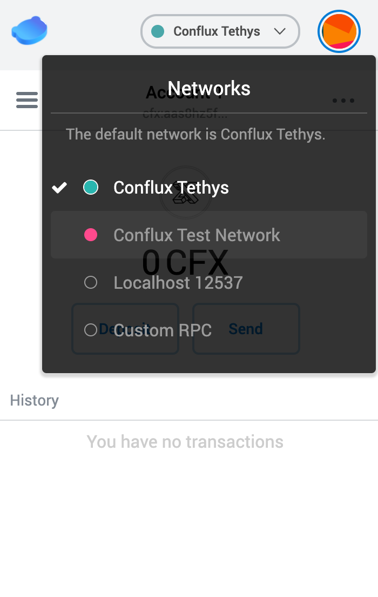
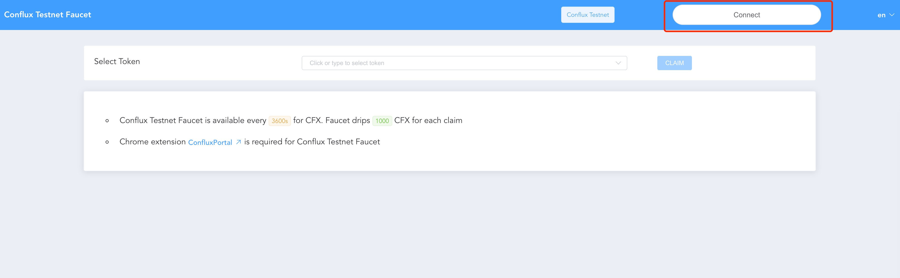
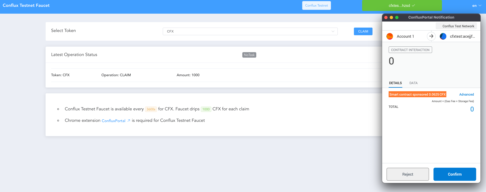
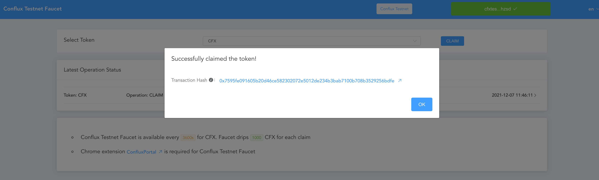
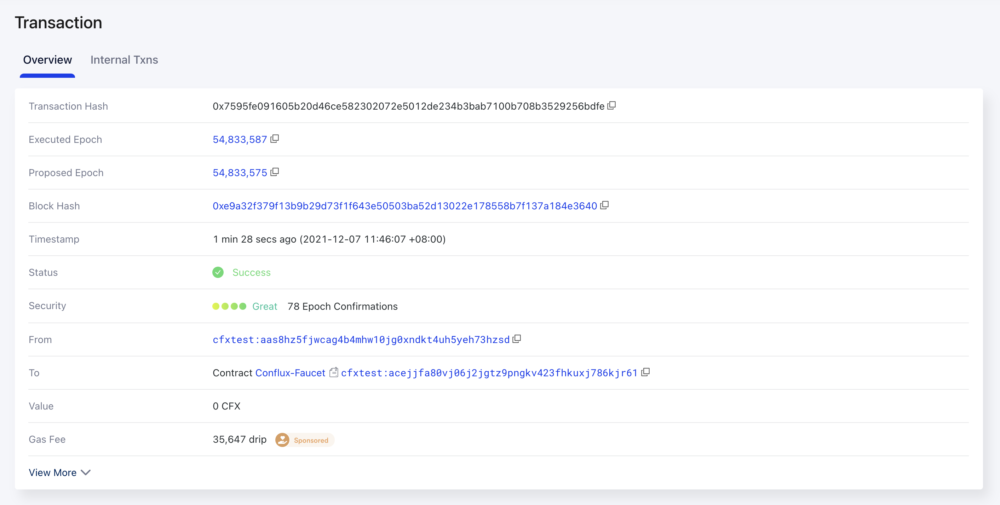
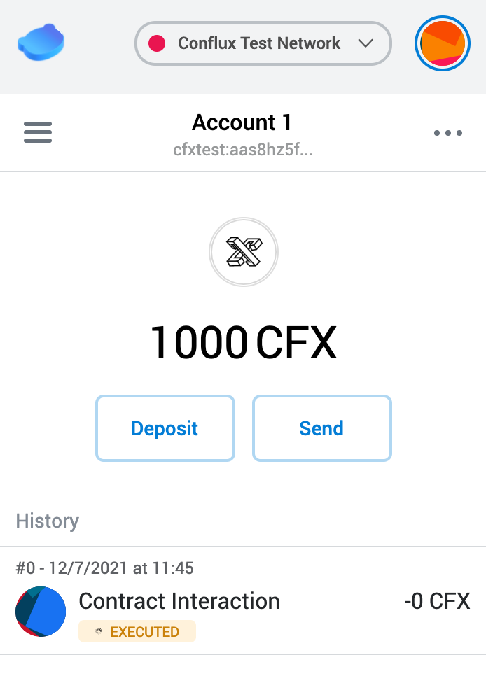
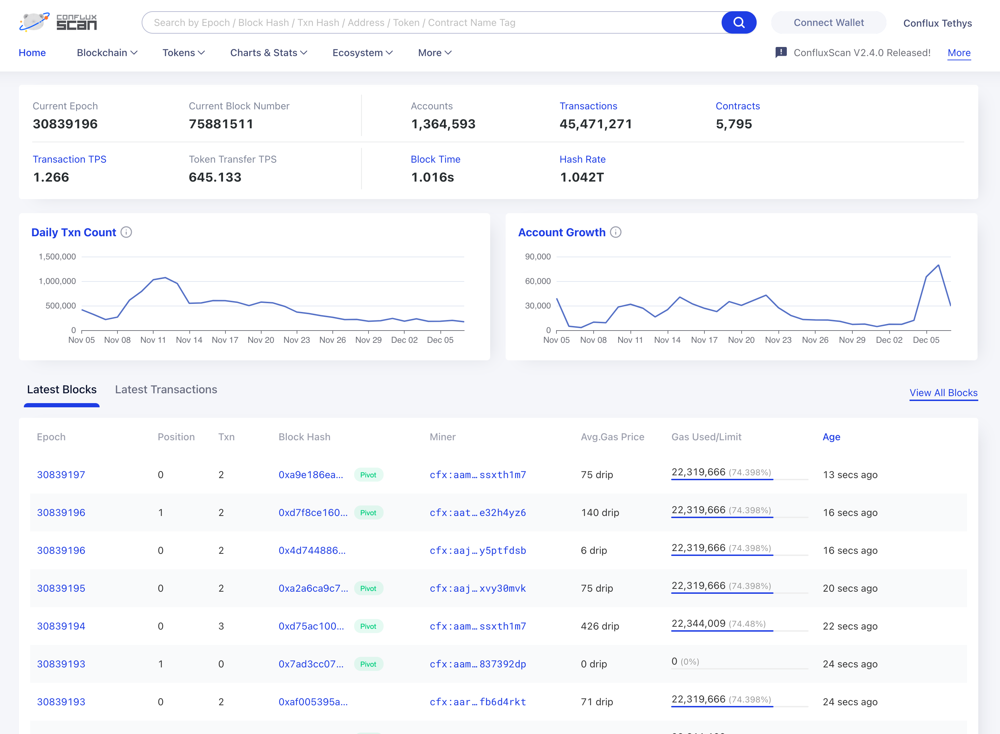

# Wallet and Faucet

体验 Conflux 网络最简单的方法是安装 Conflux 浏览器插件钱包，使用钱包进行 CFX 转账。[CFX](https://developer.confluxnetwork.org/introduction/en/conflux_basics#cfx) 是 Conflux 网络的原生代币。在 Conflux 生态中扮演着非常重要的角色(支付交易手续费，激励矿工出块等等)。类似于 Ethereum 的 ETH，CFX 的最小单位为 `Drip`, 1CFX = 10^18 Drip。

## Conflux 插件钱包

Conflux Portal 是一款浏览器插件钱包，可用于管理用户的 Conflux 资产及同 Dapp 交互。Portal 的安装和使用可参看[这篇文档](https://developer.confluxnetwork.org/guides/en/how_to_use_cfx_faucet#use-confluxportal-to-create-an-account)

## 测试网 Faucet

钱包安装好并创建账户之后，就可以体验 Conflux 去中心化网络了。首先我们需要获取一些 CFX ，然后才能体验 CFX 转账以及 Conflux 中的 Dapp。主网中的 CFX 需要参与网络挖块或其他方式获得，比较复杂。但测试网的 CFX 获取非常简单，测试网水龙头服务提供申领功能，任意账户可以直接免费领取一定数量的测试网 CFX。因为是测试网络，所以这**并不是真正的 CFX 代币**。但测试网络的功能特性与主网一样，用户和 Dapp 开发者可以在测试网上快速体验 Conflux，并测试自己开发的智能合约。

[Conflux Testnet Faucet](http://faucet.confluxnetwork.org/) 是一个测试网水龙头 Dapp，他利用 Conflux 独有的赞助商机制，实现了一个完全去中心(无后端服务)化水龙头服务，具有以下特点:

* 去中心化 Dapp，无后端服务
* 同时提供 CFX，及 CRC20 Token(类似于 ERC20) 申领服务

首先在浏览器打开测试网 faucet Dapp: http://faucet.confluxnetwork.org/ 此 Dapp 要求用户将钱包的网络切换为 Test Network 才能使用

点击右上角 connect 按钮链接钱包。点击后 Faucet 会申请连接钱包中的账户，此时会弹起一个 Portal 弹窗，用户需要选择授权的账户，并点击授权按钮。授权成功后，faucet 将会获取到账户地址。

然后在 Faucet 页面下拉框选择要申领的 Token，这里我们可以选择 CFX，然后点击 Claim 按钮，此按钮会触发一次跟合约的交互操作，本质是发送一笔交易到合约地址，因此会再次弹起 Portal 的弹窗请求用户对交易的授权，用户确认之后交易即被签名然后发送到 Conflux 网络。

不出意外交易，交易会发送成功，我们可以得到交易的 hash。

点击链接可以在 ConfluxScan 上查看交易的详情

等到交易执行成功，用户即可收到测试网的 CFX，通过钱包可以看到余额为 1000 CFX。

## [ConfluxScan](https://confluxscan.io/)

ConfluxScan 是一款 Conflux 的数据浏览器服务，可以用于查看网络的各种信息包括：

* 账户信息：余额，nonce，代币，交易历史
* 合约信息：管理员，代码，ABI 合约交互等
* 网络信息：最新纪元，算力等
* 各种工具：地址转换，NFT checker 等

Scan 使用比较简单，直接搜索账户，交易，区块等然后查看信息即可。
