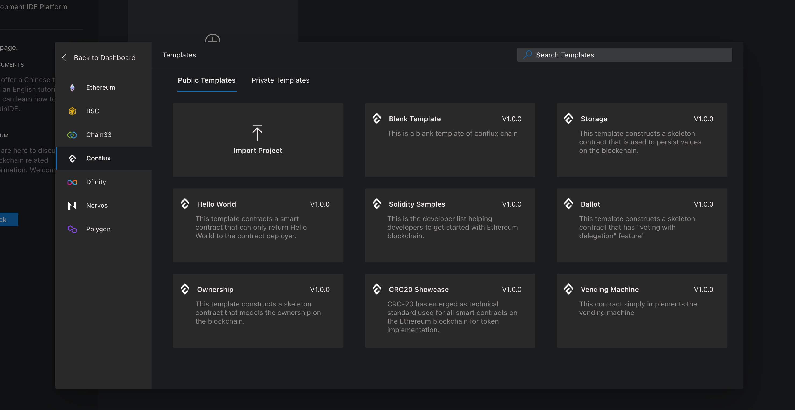
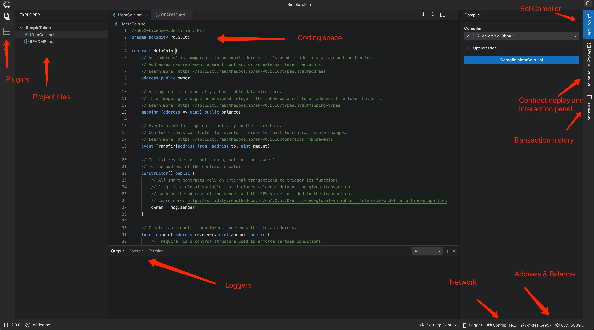
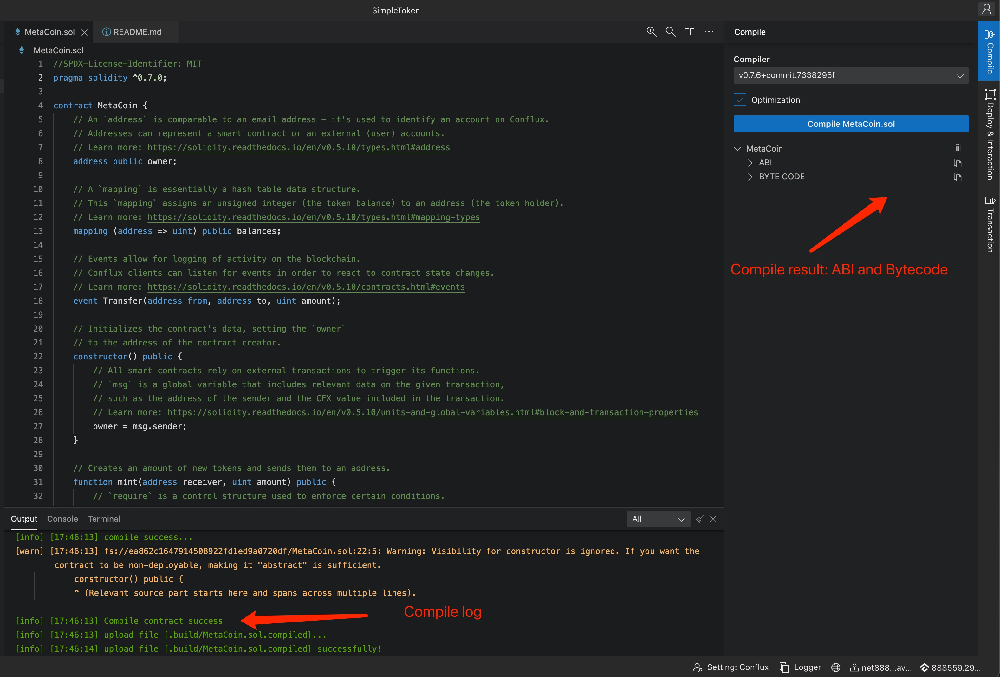
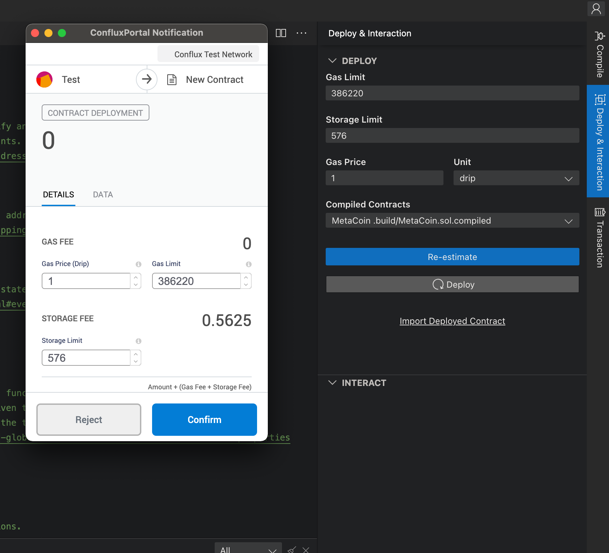
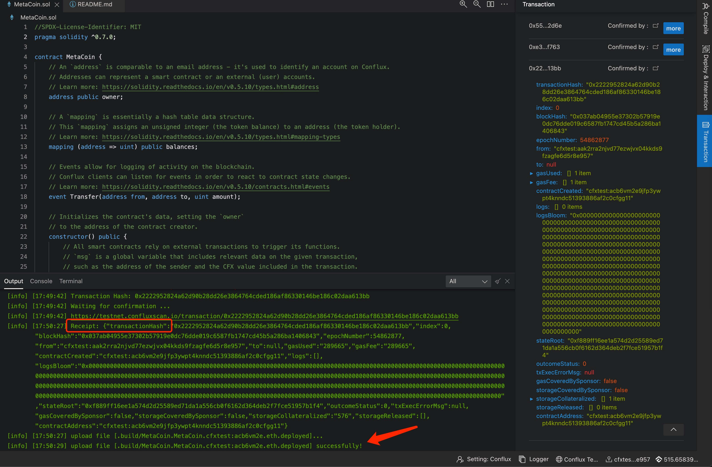
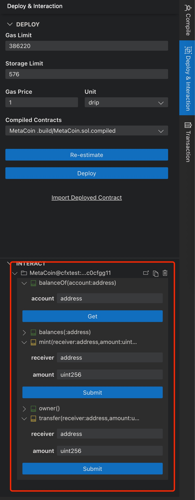

# MetaCoin contract

Conflux 网络的虚拟机采用了 EVM，同以太坊一样可以使用 Solidity 语言开发智能合约。

Solidity 是一个面向对象的，用于开发智能合约的高级语言。它是一个静态类型，支持继承的开发语言。

智能合约是用来管理 Conflux 网络状态中账户行为的程序，通过智能合约可以实现许多应用例如：投票，众筹，多签钱包等。

目前以太坊网络中的各种 ERC20 代币，Defi 项目，NFT，Dex 大部分是使用 Solidity 开发的。因此想要开发 Dapp 的话，学习 Solidity 是最佳选择。

## Blockchain 基础知识

### 交易

区块链是一个全球共享的 transaction 数据库，任何人可以读取网络中的数据，如果想修改数据库中的状态，只能通过发送 transaction 的方式，如果交易被网络中的所有人所接受，则交易会被记录到账本中，并对数据库的数据或状态产生影响。并且正如”交易“所暗含的意思(事务)，交易所想进行的数据状态修改要么全部成功，要么全部不生效（失败）。

Transaction 从一个账户发送给另外一个账户（可以是空账户）的`消息`，消息可以指定 CFX 转账的金额，也可以包含一些二进制数据（payload）。

如果目标账户包含合约代码，那该代码将会被执行，并使用 payload 作为代付的输入数据。

如果目标账户是空或null，那么交易将会使用 payload 所携带的代码创建一个新的合约账户，合约的地址将根据发送方账户地址和交易的 nonce 所生成（Conflux合约的地址生成规则还包含合约代码）。

### 区块

所有的交易将会被打包进一个个前后相连的数据块，来确定交易的前后顺序，并防止所谓的双花问题。区块将会以固定的速度被矿工打包生成，以太坊平均 17s，Conflux 平均 0.5s。

### 账户

在以太坊或 Conflux 有两类账户共享同一个地址空间：

* 外部账户
* 合约账户

两者有以下区别：

| 账户类型   | 是否有代码 | 由谁来控制 | 地址生成方式 |
| --------- | ----------| ---------| ----------|
| 外部账户   | 无        | 公私钥对  | 通过公钥生成  |
| 合约账户   | 有        | 账户代码  | 由创建合约的外部账户地址及其 nonce 确定 |

另外这两种账户都有一个 key-value 的持久化存储空间（map）, key 和 value 的长度都是 256bit，并且账户都可以有 CFX 余额。

**总结来说智能合约是用来管理 EVM 账户状态（State）的代码, 该代码存储在对应的 EVM 账户中**

我们可以通过一个 Solidity 合约例子来理解智能合约的本质：

```js
// SPDX-License-Identifier: GPL-3.0
pragma solidity >=0.4.16 <0.9.0;

contract SimpleStorage {
    uint storedData;  // The contract's state

    function set(uint x) public {  // Update contracts's state
        storedData = x;
    }

    function get() public view returns (uint) { // Read contract's state
        return storedData;
    }
}
```

以上是一个简单的 Solidity 智能合约代码:

* 它定义了一个 uint 类型的变量（状态）`storedData`，该状态被存储在合约账户的 key-value storage 中
* 一个 read 方法 `get`，用于读取合约的状态（返回 storedData 的值）
* 一个 write 方法 `set`，用于修改合约的状态（更新 storedData 的值）

这份代码如果想运行起来还需要做一些操作:

1. 使用 Solidity 编译器编译代码，得到合约的 ByteCode 和 ABI
2. 使用外部账户发送一笔交易来创建合约账户。交易的接受地址需设为`空`，payload 设为上步编译得到的 `ByteCode`。交易被区块链打包并执行后，可以查询交易的 Receipt，其中包含新创建合约账户的地址。
3. 使用外部账户发送 message (tx) 给该合约账户来调用合约代码，可以实现查询或更新合约的状态。此时交易的接受地址需设置为合约账户地址，交易的 payload 则包含想要调用的方法ID及参数（一般使用ABI 生成）。如果是状态读取操作，交易直接通过 `eth_call/cfx_call` 方法发送给 EVM 执行，并返回执行结果，交易无需打包上链；如果是更新合约状态，则交易需要进行签名并通过 `sendRawTransaction` 发送到链上打包并执行。

关于区块链和 EVM 概念的详细介绍，可以查看 Solidity 的 [智能合约 Introduction 文档](https://docs.soliditylang.org/en/v0.8.10/introduction-to-smart-contracts.html)

## Solidity 合约实例

现在我们来看一个稍微复杂一点的例子：Subcurrency。该例子实现了一个加密货币，该合约只允许创建者发行新的货币，但任何人可以通过发送交易的形式，将自己的 Coin 发给其他人。

```js
//SPDX-License-Identifier: MIT
pragma solidity ^0.7.0;

contract MetaCoin {
    // An `address` is comparable to an email address - it's used to identify an account on Conflux.
    // Addresses can represent a smart contract or an external (user) accounts.
    // Learn more: https://solidity.readthedocs.io/en/v0.5.10/types.html#address
    address public owner;

    // A `mapping` is essentially a hash table data structure.
    // This `mapping` assigns an unsigned integer (the token balance) to an address (the token holder).
    // Learn more: https://solidity.readthedocs.io/en/v0.5.10/types.html#mapping-types
    mapping (address => uint) private balances;

    // Events allow for logging of activity on the blockchain.
    // Conflux clients can listen for events in order to react to contract state changes.
    // Learn more: https://solidity.readthedocs.io/en/v0.5.10/contracts.html#events
    event Transfer(address from, address to, uint amount);

    // Initializes the contract's data, setting the `owner`
    // to the address of the contract creator.
    constructor() {
        // All smart contracts rely on external transactions to trigger its functions.
        // `msg` is a global variable that includes relevant data on the given transaction,
        // such as the address of the sender and the CFX value included in the transaction.
        // Learn more: https://solidity.readthedocs.io/en/v0.5.10/units-and-global-variables.html#block-and-transaction-properties
        owner = msg.sender;
    }

    // Creates an amount of new tokens and sends them to an address.
    function mint(address receiver, uint amount) public {
        // `require` is a control structure used to enforce certain conditions.
        // If a `require` statement evaluates to `false`, an exception is triggered,
        // which reverts all changes made to the state during the current call.
        // Learn more: https://solidity.readthedocs.io/en/v0.5.10/control-structures.html#error-handling-assert-require-revert-and-exceptions

        // Only the contract owner can call this function
        require(msg.sender == owner, "You are not the owner.");

        // Ensures a maximum amount of tokens
        require(amount < 1e60, "Maximum issuance succeeded");

        // Increases the balance of `receiver` by `amount`
        balances[receiver] += amount;
    }

    // Sends an amount of existing tokens from any caller to an address.
    function transfer(address receiver, uint amount) public {
        // The sender must have enough tokens to send
        require(amount <= balances[msg.sender], "Insufficient balance.");

        // Adjusts token balances of the two addresses
        balances[msg.sender] -= amount;
        balances[receiver] += amount;

        // Emits the event defined earlier
        emit Transfer(msg.sender, receiver, amount);
    }

    // Query balance of one account
    function balanceOf(address account) public view returns (uint) {
        return balances[account];
    }

    // Enable anyone claim 100 MetaCoin from faucet
    function faucet() public {
        balances[msg.sender] += 100;
    }
}
```

1. 代码的第一行和第二行声明了该代码的 License 和使用的 Solidity 版本
2. 然后使用 `contract` 关键词声明了一个合约类 `MetaCoin`
3. MetaCoin 类定义了两个属性(状态变量): `owner`, `balances`
4. MetaCoin 类还定了四个方法：`constructor`, `mint`, `transfer`, `faucet`
5. MetaCoin 类还定义了一个 event：`Transfer` 用于记录所有的转移事件
6. MetaCoin 类还定义了一个查询方法: `balanceOf` 用于查询用户的 MetaCoin 余额

以上就是合约的基本结构，关于 Solidity 语言的细节：数据类型，表达式，控制，函数等等，可以参看 Solidity 的 [Language Description](https://docs.soliditylang.org/en/v0.8.10/layout-of-source-files.html)

### Compiler

Solidity 合约编写好之后需要先使用编译器进行编译得到 ByteCode 才能用于部署。Solidity 的编译器（工具）有许多选择：

* 原生的 Solidity compiler 使用 C++ 开发，可以[直接下载编译好的 compiler](https://docs.soliditylang.org/en/v0.8.10/installing-solidity.html#linux-packages) 或者[自行从源码编译](https://docs.soliditylang.org/en/v0.8.10/installing-solidity.html#building-from-source)获得
* `npm` 提供了一个更加方便的安装方式 ```npm install -g solc```，此种方式安装的 `solc` 与原生编译器有一些不同，详情参看 [solcjs](https://github.com/ethereum/solc-js) 文档
* [Remix](https://remix.ethereum.org/) 是一个在线智能开发环境，可用于开发并编译小型合约和快速学习 Solidity。[ChainIDE](https://chainide.com/) 同 Remix 类似，并且支持直接部署到 Conflux 网络。
* [Truffle](https://trufflesuite.com/truffle/) 和 [Hardhat](https://hardhat.org/) 是两个目前功能强大且被很多开发者所使用的 Solidity 开发环境，不仅可以编译合约，开提供快速部署，测试，调试等功能，并拥有大量的开发插件来提供各种功能。

编译器安装好之后可以使用它来编译 Solidity 合约:

```shell
$ solc -o outputDirectory --bin --ast-compact-json --asm sourceFile.sol
```

关于 solc 的详情使用说明可以参看 [solc 官方文档](https://docs.soliditylang.org/en/v0.8.10/using-the-compiler.html#commandline-compiler)

### ChainIDE

[ChainIDE](https://chainide.com/) 是一个在线 Solidity 开发环境，并且支持部署到多条链：Ethereum, BSC, Conflux 等等。这里我们将使用它演示合约的开发，部署和交互。
因为直接使用浏览器打开该页面即可，不需要安装其他程序，比较方便。并且支持使用 Github 账号登录，登录所有创建的项目可云端保存。

进入到 [dashboard](https://chainide.com/s/dashboard) 页面后可以看到用户所有的项目，点击添加可以看到 ChainIDE 为每条链，提供了多个合约项目模板，我们先选择左侧的 Conflux 链，然后从右侧提供的模板选择一个，即可创建一个 Solidity 项目。



项目创建成功后，即进入到项目的 workspace 页面，因为合约的部署和交互需要通过钱包插件来完成，因此 workspace 页面打开时，chainIDE 会请求连接钱包账户，需要用户进行授权操作。



该页面同开发者使用的开发工具比较类似：

* 最左侧一排有多个按钮或链接，从上到下是：回到 dashboard, 项目文件按钮，插件按钮
* 第二排是文件浏览器，可以管理（查看，创建，删除，重命名）当前项目中的文件
* 第三排是代码编辑区域和运行结果输出区域
* 第四排是插件区域，可以使用最有的按钮切换，目前有编译器，部署和交互，交易 三个插件
* 最下边是状态栏右侧显示了当前的网络，用户，余额等信息。

在工作区的文件浏览器中我们可以新建合约文件，并在代码编辑区编辑代码，代码开发完成之后可以使用 Compiler 插件编译合约，这里我们使用 `MetaCoin` 合约的代码，插件会根据代码的 `pragma` 语句自动选择对应版本的编译器，点击 Compile 按钮即可开始编译工作，编译完成后会显示出合约的 ABI 和 Bytecode.



开发者可以将 ABI, Bytecode 复制出来使用 SDK 部署合约，也可以直接使用 ChainIDE 的 Deploy&Interact 插件部署和交互。切换为 Deploy 插件之后，可以选择需要部署的合约，以及设置部署合约的参数，通常情况不需要手动设置，直接点击 Estimate 会自动设置参数，然后点击 Deploy 即会呼起钱包弹窗确认后发送部署交易。（注意要保证连接的账户中有一些 CFX 用于支付交易的手续费和存储费）



等交易被打包上链并执行之后，合约即被部署成功。合约的编译部署过程在 Logger 窗口都能看到。所有发送的交易在 `Transaction` 插件中可以看到，点击交易的链接，可以到 ConfluxScan 中查看交易的详情。



合约成功部署之后，还可以在 Deploy & Interaction 插件中直接跟合约进行交互，该插件会展示所有部署的合约以及他们的地址，每个合约下面会列出该合约的所有方法：



交互分为两种，一种是调用方法查询合约的状态比如 `owner`, `balanceOf` 方法。此类方法填参后直接 `Get` 即可获取合约状态。

另外一类方法用于改变合约的状态，需要通过发送交易的方式触发，参数设置好之后，点击 `Submit` 会请求钱包插件发送交易，交易发送并执行成功之后，合约的状态才会发生变化。

在 ChainIDE 中第一类方法用绿色图标显示，第二类方法用黄色图标显示。

本合约实例实现了一个简单的代币，合约的 owner 可以给任何人 `mint` 新的 token，任何人可以将自己的 token `transfer` 给其他人。

## 参考

* [solidity-by-example](https://solidity-by-example.org/)