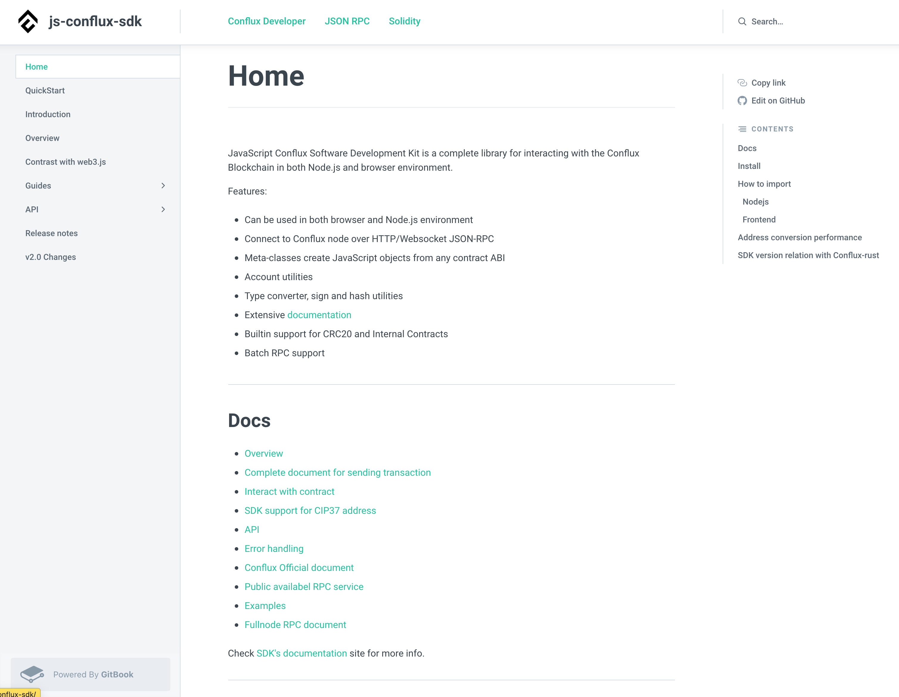

# Play with js-conflux-sdk

[`js-conflux-sdk`](https://docs.confluxnetwork.org/js-conflux-sdk) 是一个用来同 Conflux 网络交互的 `JavaScript SDK`，它提供了同区块链网络交互的所有功能。不仅可以用于浏览器环境中开发 Dapp，也可以用于 Node.js 环境开发服务和脚本。使用它可以实现更加灵活，复杂的功能。



本文我们将尝试在 Node.js 环境中使用它来`发送转账交易`并同`合约进行交互`。在开始本次演示前我们需要做如下准备：

* Node.js 环境
* 拥有 CFX 余额的私钥
* 测试网 RPC 服务：`https://test.confluxrpc.com`, 测试网 `networkId` 为 `1`
* 上节开发智能合约的 `Bytecode` 和 `ABI`

## 安装 SDK

Node.js 环境安装好之后，可以直接使用 `npm` 安装 `js-conflux-sdk`，非常简单

```sh
# 创建一个工程目录并进入
$ mkdir cfx-dapp-tutorial && cd cfx-dapp-tutorial
# 初始化该项目
$ npm init -y
# 安装 SDK
$ npm install js-conflux-sdk
```

Note: 本示例使用 Mac 系统

## 初始化

SDK 的 [`Conflux`](https://docs.confluxnetwork.org/js-conflux-sdk/api/conflux) 类是跟网络交互的主类，该类提供了所有 Conflux-rust 节点 [RPC 方法](http://developer.confluxnetwork.org/conflux-doc/docs/json_rpc/) 的封装，使用这些方法可以查询账户在网络上的信息以及发送交易。因此第一步我们需要引入并创建该类的实例：

```js
// 引入 Conflux 类
const { Conflux } = require('js-conflux-sdk');
// 创建实例，url, networkId 是必选项
const conflux = new Conflux({
  url: 'https://test.confluxrpc.com',
  networkId: 1
});
```

js-conflux-sdk 使用现代化的 `Promise` 来优化 JS 的异步编程体验，所有的异步调用都会返回 Promise 对象。

```js
conflux.cfx.getStatus().then(status => {
  console.log('Current network status: ', status);
});
/*
{
  bestHash: '0x899eda207805a7e44255990222b6af04ebfb2e4d17e4a695b6a11642367644be',
  blockNumber: 2608677,
  chainId: 8888,
  epochNumber: 797228,
  latestCheckpoint: 740000,
  latestConfirmed: 797187,
  latestFinalized: '0xc28f8',
  latestState: 797224,
  networkId: 8888,
  pendingTxNumber: 4062
}
*/
```

如果配合 ES6 最新的 `async/await` 语法使用更加方便

```js
async funciton main() {
  const status = await conflux.cfx.getStatus();
  console.log(status);
}
```

除了 `Conflux`, SDK 还提供实现各种功能的多个模块

```js
module.exports = {
  CONST,
  Conflux,
  Contract,
  Wallet,
  Transaction,  // 可用于交易的签名和构造
  Message,
  PersonalMessage,
  Drip,  // CFX，Drip 转换
  providerFactory,
  sign,  // 常见加密，签名方法
  format,  // 多种数据格式化方法
  PrivateKeyAccount,
  address,  // 地址 encode/decode 及相关 utilities
  providerWrapper,
};
```

## RPC 方法调用

`conflux` 实例上根据 RPC 命名空间，将方法划分到不同的 module 之下，比如所有以 `cfx` 为前缀的方法在 `conflux.cfx` 中有对应的实现，除 `cfx` 之外还有 `pos`，`txpool`，`trace`，`debug` 等模块。

其中 `cfx` 中的方法是最核心，并且使用最频繁的，可以用来获取区块链的各种信息：区块，交易，receipt，账户的余额nonce等等，也可以用于发送交易。

```js
// 获取网络当前状态
const status = await conflux.cfx.getStatus();
//
const balance = await conflux.cfx.getBalance(account.address);
//
const nonce = await conflux.cfx.getNextNonce(account.address);
//
const tx = await conflux.cfx.getTransactionByHash('0x899eda207805a7e44255990222b6af04ebfb2e4d17e4a695b6a11642367644be');
//
const receipt = await conflux.cfx.getTransactionReceipt('0x899eda207805a7e44255990222b6af04ebfb2e4d17e4a695b6a11642367644be');
```

具体的方法列表可查看 SDK 的 [API 文档](https://docs.confluxnetwork.org/js-conflux-sdk/api/conflux)或 [Fullnode 的 RPC 文档](http://developer.confluxnetwork.org/conflux-doc/docs/json_rpc/)。

## 发送交易

交易是进行 `CFX 转账`及`修改合约状态`的唯一方式，因此发送交易是区块链世界最频繁的操作。使用钱包可以非常方便，快速完成一笔交易发送。但如果需要跟合约进行复杂操作，需要使用 Dapp，Dapp 底层也是用 SDK 来完成交易的构造。现在我们来看如何使用 js-conflux-sdk 来发送一笔 CFX `转账`交易。

所有的交易需要使用发送方的私钥进行签名才能被区块链网络所接受，因此首先我们需要将交易发送方的私钥添加到 conflux 的 `wallet` 中，在 SDK 发送交易时，会根据交易的 `from` 到 wallet 查找私钥，并用它对交易进行签名。(如果 SDK 在 wallet 找不到对应的私钥会将未签名的交易直接通过 cfx_sendTransaction 方法发送出去，此种情况交易的签名操作需由 RPC provider 或节点来实现)

```js
// 如果需要发送交易，需要先将发交易账户的私钥加入到 wallet 中
const account = conflux.wallet.addPrivateKey(process.env.PRIVATE_KEY);  // 需要使用个人私钥替换该方法的参数
```

使用 js-sdk 发送交易非常简单，直接调用 `conflux.cfx.sendTransaction` 方法并指定交易的 `from`, `to`, `value` 即可。

```js
const hash = await conflux.cfx.sendTransaction({
  from: account.address,
  to: 'cfxtest:aak2rra2njvd77ezwjvx04kkds9fzagfe6d5r8e957',
  value: Drip.fromCFX(1)
});
console.log(hash);
// 0xe50d114e61686d794dd3c835c1cc9fdbd0a442c737ca522c01295911f005423c
```

不出意外，交易会被成功发送到节点的交易池，并返回交易的 hash, 交易会经历从 pending 到打包，[到执行多个阶段](https://docs.confluxnetwork.org/crypto-notes/all-about-tx/transaction-stage-explain)。当交易被成功执行之后，CFX 转账才会真正生效。我们可以使用交易的 hash 获取交易的详细信息和 receipt。其中 receipt 只有等交易被执行之后才能获取到。

```js
const tx = await conflux.cfx.getTransactionByHash(hash);
console.log(tx);

const receipt = await conflux.cfx.getTransactionReceipt(hash);
console.log(receipt);
```

获取到的 `tx` 中有一个  `status` 字段，`receipt` 中有一个 `outcomeStatus` 可以用来判断交易的状态， 如果是 `0` 则表示交易执行成功，`1` 为失败。

关于[交易](http://developer.confluxnetwork.org/conflux-doc/docs/json_rpc/#cfx_gettransactionbyhash)和[Receipt](http://developer.confluxnetwork.org/conflux-doc/docs/json_rpc/#cfx_gettransactionreceipt) 的详细信息可参看其各自 RPC 文档。

其实一笔交易除了 from, to, value 还包含多个字段：

* nonce
* data
* gas
* gasPrice
* storageLimit
* chainId
* epochHeight

具体各字段的含义可参看[交易详解](http://developer.confluxnetwork.org/sending-tx/en/transaction_explain#how-to-construct-a-transaction)

使用 SDK 发送交易，这些字段都可以自行指定:

```js
// 获取网络当前的 epochNumber
const epochNumber = await conflux.cfx.epochNumber();
// 获取用户当前的 nonce
const nonce = await conflux.cfx.getNextNonce(account.address);
// 自行设置交易各字段
const txMeta = {
  from: account.address,
  to: 'cfxtest:aak2rra2njvd77ezwjvx04kkds9fzagfe6d5r8e957',
  nonce,
  data: '0x',
  gasPrice: 1,  // 测试网可使用 1drip 的 gasPrice
  chainId: 1,  // 测试网 chainId
  epochHeight: epochNumber,
  value: Drip.fromCFX(1)
};
// 预估交易所会使用的 gas 和 存储
const estimated = await conflux.cfx.estimateGasAndCollateral(txMeta);
txMeta.gas = estimated.gasLimit;
txMeta.storageLimit = estimated.storageCollateralized;
// 发送交易
const hash = await conflux.cfx.sendTransaction(txMeta);
```

另外 sendTransaction 返回的对象上提供了几个 helper 方法, 可用于获取不同阶段的交易信息:

* get: 获取交易信息
* mined: 等到交易被打包，然后返回交易信息
* executed: 等到交易被执行，然后返回交易信息
* confirmed: 等到交易被确认，然后返回交易信息

```js
const pendingTx = conflux.cfx.sendTransaction({
  from: account.address,
  to: 'cfxtest:aak2rra2njvd77ezwjvx04kkds9fzagfe6d5r8e957',
  value: Drip.fromCFX(1)
});

const tx = await pendingTx.get();

const minedTx = await pendingTx.mined();

const receipt = await pendingTx.executed();

const confirmedReceipt = await pendingTx.confirmed();
```

注意：如果交易没有达到被打包条件，一直 pending 在交易池中，后边几个方法将会等到`超时`然后失败

## 合约交互

js-conflux-sdk 还可以用于很方便的与合约交互，包括部署合约，查询合约状态，更新合约状态。我们使用上节开发的 MetaCoin 合约来演示如何使用 SDK 同合约进行交互。

### 部署合约

跟合约交互第一步就是将合约的 bytecode 通过交易的 data 发送到链上，完成合约的部署。SDK 提供了 `Contract` 方法用于通过 bytecode，ABI 来构造一个 SDK 合约实例，此实例提供了与合约各个方法对应的 JS 对象方法，可以用来查询合约数据或构造更新合约状态的交易。

```js
// 使用 abi 和 bytecode 构造合约实例（部署合约时需要设置 bytecode 选项）
const metaCoinAbi = [{
    "inputs": [],
    "stateMutability": "nonpayable",
    "type": "constructor"
  }, {
    "inputs": [
      {
        "internalType": "address",
        "name": "account",
        "type": "address"
      }
    ],
    "name": "balanceOf",
    "outputs": [
      {
        "internalType": "uint256",
        "name": "",
        "type": "uint256"
      }
    ],
    "stateMutability": "view",
    "type": "function"
  },
  ...
];
const metaCoinBytecode = '0x60806040523480156100105760...'
const metaCoin = conflux.Contract({
  abi: metaCoinAbi,
  bytecode: metaCoinBytecode
});
// 调用 metaCoin 实例的 constructor 方法来构造合约部署的交易并发送
const receipt = await metaCoin.constructor().sendTransaction({  // 如果合约的构造函数有参数，在调用 constructor() 时需要设置参数
  from: account.address
})executed();
// 等交易成功执行之后，可以在 receipt 获取到部署的合约地址
console.log(receipt.conractCreated);
// 合约地址：cfxtest:ach59mdc6fvgp0zemyzd262d95vam3mj26wknds1br
```

需要注意的几个地方：

* 构造部署合约的 SDK 合约实例时，需要设置 bytecode，不用设置合约地址
* 部署合约的交易的 to 需要设置为 null 或空
* 部署交易执行成功之后，可以在 receipt 查看新创建的合约地址

### 查询合约状态

合约部署之后可以调用合约方法查询合约的状态，查询状态不需要发送交易，直接调用即可，本质是调用 [`cfx_call`](https://developer.confluxnetwork.org/conflux-doc/docs/json_rpc#cfx_call) 方法。SDK 构造的 JS 合约对象包含与合约方法一一对应的 JS 方法，可以很方便的实现方法调用。MetaCoin 合约有一个 `balanceOf` 方法，可用于查询某个人 MetaCoin 的余额。

```js
// 通过 abi 和 地址 构造合约实例
const metaCoinAddress = 'cfxtest:ach59mdc6fvgp0zemyzd262d95vam3mj26wknds1br';
const metaCoin = conflux.Contract({
  abi: metaCoinAbi,
  address: metaCoinAddress,
});
// 合约的所有方法都可以直接通过 metaCoin 调用
// 查询某用户的 MetaCoin 余额
const balance = await metaCoin.balanceOf(account.address);

// 查询方法时还可以设置高级参数
const balanceByAdvanceCall = await metaCoin.balanceOf(account.address).call({
  from: account.address
});
```

### 更新合约状态

MetaCoin 有两个方法 `mint` 和 `transfer` 可用于发行新的 MetaCoin 和 转账 MetaCoin。这两个方法都会更新合约的状态，所以需要通过发送交易的方式调用。

```js
// 通过 abi 和 地址 构造合约实例
const metaCoinAddress = 'cfxtest:ach59mdc6fvgp0zemyzd262d95vam3mj26wknds1br';
const metaCoin = conflux.Contract({
  abi: metaCoinAbi,
  address: metaCoinAddress,
});

const mintReceipt = await metaCoin.mint(account.address, 10000000).sendTransaction({
  from: account.address
}).executed();

const balance = await metaCoin.balanceOf(account.address);
console.log(`Balance of ${account.address} is ${balance}`);

const secondAddress = 'cfxtest:aat6sxw4tdn3ztsau66f3m9e258xbdk53anfkrzzdm';
const transferReceipt = await metaCoin.transfer(secondAddress, 10000).sendTransaction({
  from: account.address
}).executed();
```

关于 SDK 的更多用法可参看其[文档](https://docs.confluxnetwork.org/js-conflux-sdk)，除了 Js SDK，Conflux 基金会还开发了 Go, Java, Python 等几个语言的 [SDK](https://developer.confluxnetwork.org/sdks-and-tools/en/conflux_sdks) ，社区也开发了 C++，C# 等语言的 SDK，开发者可以根据项目的需求灵活选择。
