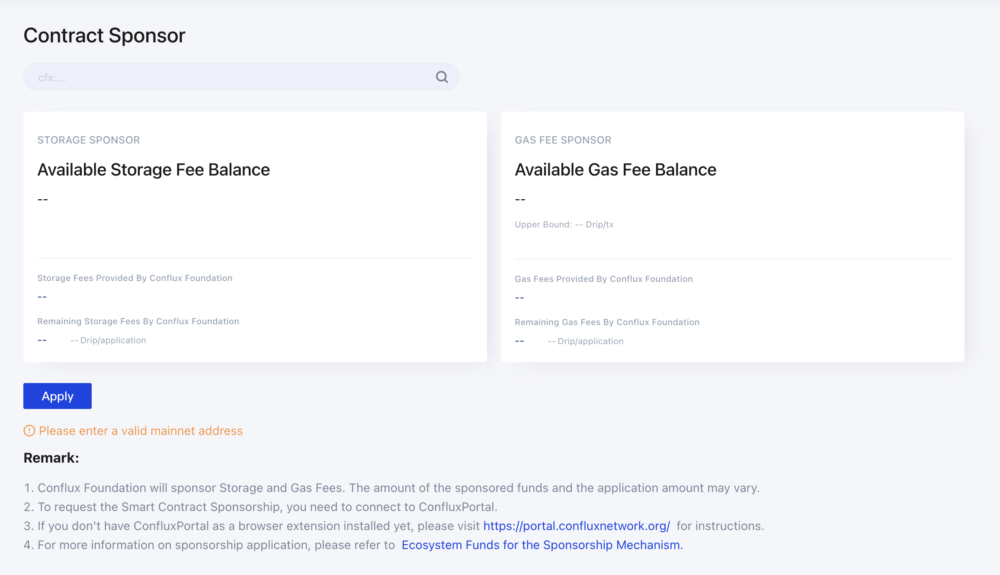
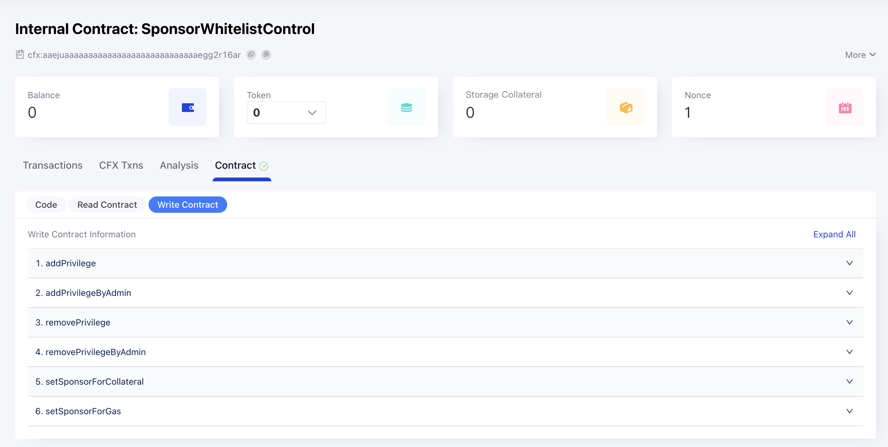

# 为合约设置 Sponsor

Conflux 网络不仅具有 TPS 高，手续费低的巨大优势，还有一个独特的[赞助商机制](https://developer.confluxnetwork.org/conflux-rust/internal_contract/internal_contract#sponsorwhitelistcontrol-contract)：任何人可以对合约的燃气费和存储抵押费用进行赞助，
用户与被赞助的合约进行交互时将不需要支付手续费或存储抵押费，该费用由合约的赞助商支付。

## 使用 Scan 的赞助服务

为了扶植生态项目，优化用户的使用体验，Conflux 基金会对生态项目免费提供小额的赞助服务，任何合约可直接在 ConfluxScan 的[赞助页面](https://confluxscan.io/sponsor)申请赞助服务。



当前 scan 页面可直接申请的赞助额度如下：

1. 燃气费：5 * 1 Gdrip, upper bound 500,000 drip
2. 存储抵押费：5 * 100 cfx

如果合约使用额度超过此限制，可联系基金会申请更大额度。

## 通过 Sponsor 内置合约设置大额赞助

除了想基金会申请赞助，开发者或项目方也可以自行对自己的合约进行赞助，直接跟 [`SponsorWhitelistControl`](https://confluxscan.io/address/cfx:aaejuaaaaaaaaaaaaaaaaaaaaaaaaaaaaegg2r16ar?tab=contract-viewer) 内置合约交互即可，可以灵活设置赞助额度及单次赞助上限。

### 赞助燃气费

给一个合约设置燃气赞助商需要调用 SponsorWhitelistControl 内置合约的 `setSponsorForGas` 方法，该方法第一个参数是`要赞助的合约地址`，第二参数是`单次`交易可以赞助燃气费的上限（单位是 Drip）。如果某次交易的燃气费用超过了该值，即使合约有赞助商，该笔交易的燃气费也不会被赞助。

燃气费的赞助`金额`则通过交易的 `value` 来设置，即调用方法的同时进行 CFX 转账，转的所有 CFX 都会成为合约燃气费的赞助余额。

### 赞助存储抵押费用

给合约设置存储抵押赞助商则是调用 SponsorWhitelistControl 合约的 `setSponsorForCollateral` 方法，该方法只有一个参数即 `要赞助的合约地址`

存储费的赞助金额同样通过交易的 `value` 来设置。

### 设置白名单

另外赞助商机制中还有一个白名单机制，即只有在白名单中的地址，才会被赞助商所赞助。零地址（`0x0000000000000000000000000000000000000000`）是一个特殊地址，被加入白名单之后，所有地址都可使用赞助商服务。

## 设置方式

### 直接使用 SDK 同内置合约交互

JS SDK 包含了对内置合约的直接支持

```js
const { Drip, CONST } = require('js-conflux-sdk');

const SponsorWhitelistControl = conflux.InternalContract('SponsorWhitelistControl');

async function setGasSponsor() {
  const upperBound = Drip.fromGDrip(10);
  const receipt = await SponsorWhitelistControl
    .setSponsorForGas(MetaCoinAddress, upperBound)
    .sendTransaction({
      from: account.address,
      value: Drip.fromCFX(3),
    })
    .executed();
  console.log('Set gas sponsor', receipt.outcomeStatus === 0 ? 'success' : 'fail');
}

async function setStorageSponsor() {
  const receipt = await SponsorWhitelistControl
    .setSponsorForCollateral(MetaCoinAddress)
    .sendTransaction({
      from: account.address,
      value: Drip.fromCFX(50),
    })
    .executed();
  console.log('Set storage sponsor', receipt.outcomeStatus === 0 ? 'success' : 'fail');
}

async function setWhiteList() {
  const receipt = await SponsorWhitelistControl
    .addPrivilegeByAdmin(MetaCoinAddress, [CONST.ZERO_ADDRESS_HEX])
    .sendTransaction({
      from: account.address,
    })
    .executed();
  console.log('Set whitelist', receipt.outcomeStatus === 0 ? 'success' : 'fail');
}
```

### 使用 Scan 的合约交互功能

另外 Scan 上的合约如果进行了验证或注册，则可以直接使用 Scan 合约页面的读写功能与合约进行交互，目前所有[内置合约](https://confluxscan.io/contracts)都进行了验证可以直接使用。用户只需要连接钱包插件，然后选择对应的方法并设置好参数和 `value`，然后点击 write 按钮发起交易即可。



## 注意

如果已有赞助商想增加赞助余额直接再次调用相关方法即可。如果想更换赞助商同样也是调用这几个方法，但设置的金额和 upperBound 有一些要求，具体规则可参看 [SponsorWhitelistControl](https://developer.confluxnetwork.org/conflux-rust/internal_contract/internal_contract#sponsorwhitelistcontrol-contract) 详细介绍